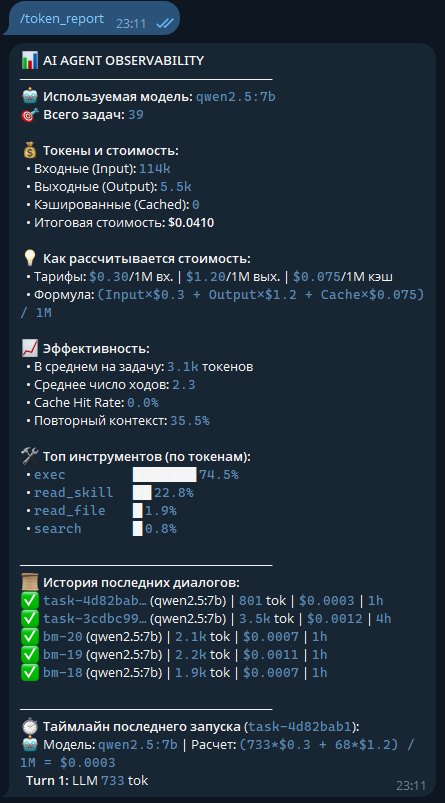

# Autonomous Agentic Telegram Gateway (Stateful ReAct, Skills & Observability)

Асинхронный автономный Telegram-агент на Python 3.11+ с плагинным инференсом через локальные модели Ollama (`qwen2.5:7b`, `llama3.2` и др.).
Оснащен **персистентной долговременной памятью диалогов в SQLite**, поддержкой **ReAct-инструментов** с универсальным **`exec`**, специализированными регламентами-навыками (**Skills**), анти-зацикливающим харнессом и встроенной подсистемой **Observability & FinOps**.

---

## 🏛 Архитектура: Hexagonal (Ports & Adapters)

Система строго разделена на слои с направлением зависимостей снаружи внутрь:

```
[ Telegram (aiogram 3.x) ]  --> (Driving Adapter) ──┐
[ CLI Dashboard (rich)   ]  --> (Driving Adapter) ──┤
                                                    ▼
                                           ┌─────────────────┐
                                           │   AgentRunner   │
                                           │  (Domain Core)  │
                                           └────────┬────────┘
                                                    │
                   ┌────────────────────────────────┼────────────────────────────────┐
                   ▼                                ▼                                ▼
       [ ToolRegistry (ReAct) ]         [ ObservabilityEngine ]           [ Abstract Ports ]
        - exec (universal CLI/cURL)      - Spans (LLM & Tools)             - BaseLLMPlugin
        - read_skill (skills/*.md)       - Context overlap/repetition      - BaseMemoryStore
        - read_file (safe path)          - Pricing calculation ($)
        - search (grep engine)           - SQLite (WAL mode)
        - run_tests (pytest sandbox)                │
        - git_diff (repo state)                     ▼
                                       ┌─────────────────────────┐
                                       │     Driven Adapters     │
                                       ├─────────────────────────┤
                                       │ - OllamaPlugin (httpx)  │
                                       │ - SqliteMemoryStore(DB) │
                                       │ - TelemetryStorage (DB) │
                                       └─────────────────────────┘
```

### 1. Доменное ядро и Харнесс (`core/`)
* **Оркестратор (`core/runner.py`)**: `AgentRunner` координирует ReAct-цикл (по умолчанию до 8 шагов) с автоматическим перехватом вызовов моделей и инструментов.
* **Защита от зацикливания (Anti-Looping Fallback)**: при достижении лимита шагов агент не обрывает сессию ошибкой, а отправляет системный запрос на принудительный синтез собранных данных в `Final Answer`.
* **Автоиндексация скиллов**: агент сканирует каталог `skills/` и инжектирует доступные сценарии в системный промпт.
* **DTO-модели (`core/models.py`)**: `ChatMessage`, `PromptPayload`, `AgentResult`.
* **Абстрактные порты (`core/ports/`)**: `BaseLLMPlugin`, `BaseMemoryStore`.
* **Изоляция ошибок (`core/exceptions.py`)**: `LLMTimeoutError`, `LLMConnectionError`, `LLMResponseError`.

### 2. Подсистема инструментов (`core/tools/`)
Набор встроенных инструментов агента:
* **`exec`**: универсальное выполнение терминальных/консольных команд (CLI, cURL, bash, git, python) с таймаутом 30с и ограничением вывода до 4 КБ для защиты контекста.
* **`read_skill`**: динамическое чтение регламентов и пошаговых сценариев из папки `skills/`.
* **`read_file`**: чтение файлов с защитой от Path Traversal (`_resolve_safe_path`).
* **`search`**: поиск подстрок в кодовой базе с фильтрацией служебных каталогов.
* **`run_tests`**: запуск тестов без `shell=True` с проверкой белого списка (`pytest`).
* **`git_diff`**: просмотр незакоммиченных изменений в репозитории.

### 3. Специализированные навыки агента (`skills/`)
* **`morning-briefing` (`skills/morning-briefing/SKILL.md`)**: утренний сценарий — запрос погоды в запрашиваемом городе (по умолчанию Москва) через `curl wttr.in/<City>?format=3`, проверка системной даты и времени, формирование вдохновляющей сводки.
* **`system-health` (`skills/system-health/SKILL.md`)**: DevOps-диагностика — проверка аптайма хоста/контейнера, памяти, диска и доступности API Ollama с формированием отчета о состоянии.

### 4. Долговременная память (`adapters/memory/sqlite.py`)
* **`SqliteMemoryStore`**: персистентное хранение истории диалога каждого пользователя в базе `data/chat_history.db` в режиме WAL.
* **Непрерывный контекст**: диалог не сбрасывается при перезапусках бота или контейнера.
* **Команда `/new`**: архивирует предыдущий диалог и начинает чистый контекст с нуля.

### 5. Автономный модуль Observability & FinOps (`core/observability/`)
* **Трейсинг**: `LLMCallSpan` и `ToolCallSpan` для детального пошагового таймлайна задачи.
* **Оценка расходов**: точный расчет стоимости на основе тарифов ($/1M токенов: Input, Output, Cache).
* **Анализ повторного контекста**: замер доли повторяющихся токенов (`repeated_tokens`) между шагами ReAct-цикла.
* **Хранилище**: `data/telemetry.db` (SQLite WAL).

### 6. Входные адаптеры (`adapters/`)
* **Telegram Bot (`adapters/telegram/`)**:
  * `/start` — статус агента и приветствие.
  * `/help` — перечень команд и возможностей.
  * `/new` — сброс контекста и старт чистого диалога.
  * `/morning_briefing` — вызов сценария утренней сводки (погода, дата, рекомендации).
  * `/system_health` — вызов сценария диагностики контейнера и инфраструктуры.
  * `/skills` — список зарегистрированных сценариев (скиллов).
  * `/token_report` — глобальный дашборд по токенам, затратам и эффективности.
  * `/token_report <task_id>` — детальный таймлайн конкретной задачи по шагам.
  * `AuthMiddleware`: белый список доступа по Telegram User ID.
  * `splitter.py`: деление сообщений длиннее 4000 символов с сохранением блоков кода Markdown.
  * `typing.py`: индикация набора текста во время работы агента.
* **CLI Dashboard (`core/observability/cli.py`)**:
  * `python -m core.observability.cli [--limit 5] [--task-id <id>]`.

---

## 📊 Мониторинг токенов (FinOps Dashboard)

### Просмотр в Telegram
* Отправьте боту команду `/token_report` для получения текущей статистики:
  * Использованная модель и тарифы за 1M токенов.
  * Формула расчета стоимости.
  * Статистика: Input, Output, Cached, Repeated Context %, доли инструментов.
  * История последних 5 запусков и таймлайн последнего выполнения.
* `/token_report <task_id>` — детальный пошаговый разбор конкретного выполнения.

<p align="center">
  
</p>

### Просмотр в терминале (Rich TUI)
```bash
python -m core.observability.cli --limit 5
```

---

## 🔐 Безопасность и Docker Sandbox (Zero-Knowledge)

Все секреты передаются **исключительно через Docker Secrets** в виртуальную память (`tmpfs`) по пути `/run/secrets/`.
* ❌ **Секреты НЕ передаются через переменные окружения** (не видны в `docker inspect` или `/proc/1/environ`).
* ❌ **Секреты НЕ попадут в git** (`secrets/*.txt` и `data/*.db` добавлены в `.gitignore`).
* 🛡 **Харденинг контейнера**: non-root пользователь (`appuser`, UID 10001), сброс всех Linux capabilities (`cap_drop: [ALL]`), запрет повышения привилегий (`no-new-privileges: true`), лимиты ресурсов CPU/RAM/PIDs.

### 1. Подготовка секретов
```bash
cp secrets/telegram_bot_token.txt.example secrets/telegram_bot_token.txt
cp secrets/allowed_user_ids.txt.example secrets/allowed_user_ids.txt
```
* В `secrets/telegram_bot_token.txt` вставьте токен вашего бота.
* В `secrets/allowed_user_ids.txt` укажите ваш Telegram User ID.

### 2. Запуск контейнеров
```bash
docker compose up -d --build
```

---

## 🛠 Локальная разработка и тестирование

### Установка окружения (uv / pip)
```bash
uv venv --python 3.11
# Linux/macOS:
source .venv/bin/activate
# Windows:
.venv\Scripts\activate

uv pip install -r requirements-dev.txt
```

### Запуск тестов
Проект разработан строго по методологии TDD:
```bash
pytest -v
```
Все **154 теста** (память SQLite со скользящим окном, ReAct-харнесс, Observation Compactor, сжатие промптов, утилита exec, загрузка скиллов, анти-зацикливание, спаны обсервабилити, расчет стоимости и хендлеры Telegram) проверяют функциональность и стабильность системы с 100% успехом.

---

## ⚡️ Оптимизация токенов и контекста (Phase 2 FinOps)

Во 2 этапе внедрены 3 ключевые архитектурные оптимизации для устранения «пожирателей токенов»:

1. **Observation Compactor (`core/runner.py`)**:
   * Для предыдущих ходов ReAct-цикла (`turn < N-1`) промежуточные выводы инструментов длиннее 250 символов автоматически сжимаются с обрезкой по границам слов и маркером `\n... [Observation compacted: {orig} -> {max} chars]`.
   * Вывод непосредственно предшествующего шага сохраняется полностью для точности рассуждений модели.
2. **Скользящее окно истории диалога (`Sliding Window`)**:
   * `SqliteMemoryStore.get_history(limit=10)` использует обратный подзапрос `ORDER BY id DESC LIMIT ?` с внешним `ORDER BY id ASC`.
   * Хранит полную историю в БД, но передает агенту только последние 5 раундов общения, останавливая неограниченный рост контекста.
3. **Минификация схем инструментов и системного промпта**:
   * Схемы JSON сериализуются компактно (`separators=(',', ':')`).
   * Плотные директивы ReAct сократили объем системного промпта более чем на 30%.

### 📊 Результаты бенчмарка: До и После (20 задач)

| Метрика | Baseline (Фаза 1.5) | Phase 2 (Optimized) | Экономия |
| :--- | :---: | :---: | :---: |
| **Суммарный объем токенов** | **95,386** | **59,129** | **-38.0%** (цель: $\ge 30\%$) |
| **Входные токены (Input)** | 90,035 | 55,963 | -37.8% |
| **Выходные токены (Output)** | 5,351 | 3,166 | -40.8% |
| **Стоимость инференса** | **$0.03344** | **$0.02059** | **-38.4%** |
| **Успешность выполнения** | **100% (20/20)** | **100% (20/20)** | 0% деградации |

