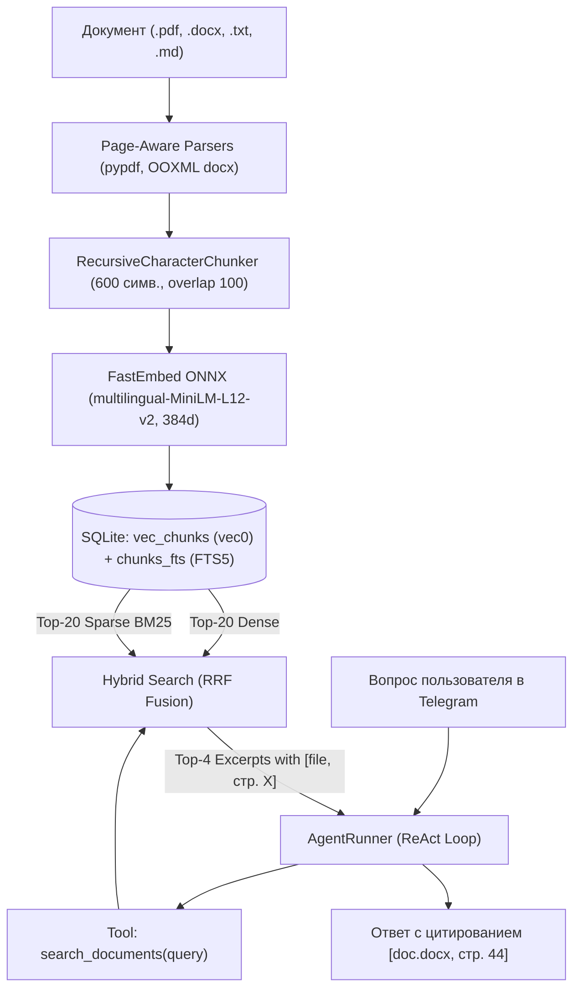
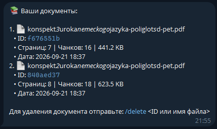

# Autonomous Agentic Telegram Gateway (Stateful ReAct, Skills & Observability)

Асинхронный автономный Telegram-агент на Python 3.11+ с плагинным инференсом через локальные модели Ollama (`qwen2.5:7b`, `llama3.2` и др.).
Оснащен **персистентной долговременной памятью диалогов в SQLite**, поддержкой **ReAct-инструментов** с универсальным **`exec`**, специализированными регламентами-навыками (**Skills**), анти-зацикливающим харнессом и встроенной подсистемой **Observability & FinOps**.

---

## 🏛 Архитектура: Hexagonal (Ports & Adapters)

Система строго разделена на слои с направлением зависимостей снаружи внутрь:

```
[ Telegram (aiogram 3.x) ]  --> (Driving Adapter: Messages & Docs) ──┐
[ CLI Dashboard (rich)   ]  --> (Driving Adapter: Observability)   ──┤
                                                                     ▼
                                                            ┌─────────────────┐
                                                            │   AgentRunner   │
                                                            │  (Domain Core)  │
                                                            └────────┬────────┘
                                                                     │
        ┌────────────────────────────┬───────────────────────────────┼───────────────────────────────┐
        ▼                            ▼                               ▼                               ▼
 [ ToolRegistry (ReAct) ] [ ObservabilityEngine ]           [ Abstract Ports ]               [ RAG Subsystem ]
  - search_documents (RAG) - Spans (LLM & Tools)             - BaseLLMPlugin                  - Format Parsers
  - exec (CLI/cURL)        - Token metrics ($)               - BaseMemoryStore                - Page-Aware Chunker
  - read_skill             - Context overlap                 - BaseEmbeddingProvider          - Hybrid BM25 & Vec
  - read_file, search      - SQLite WAL                      - BaseRAGStore                   - RRF Fusion Engine
                                                                     │
                                                                     ▼
                                                        ┌─────────────────────────┐
                                                        │     Driven Adapters     │
                                                        ├─────────────────────────┤
                                                        │ - OllamaPlugin (httpx)  │
                                                        │ - SqliteMemoryStore(DB) │
                                                        │ - FastEmbedProvider     │
                                                        │ - SqliteVecStore (DB)   │
                                                        │ - TelemetryStorage (DB) │
                                                        └─────────────────────────┘
```

### 1. Доменное ядро и Харнесс (`core/`)
* **Оркестратор (`core/runner.py`)**: `AgentRunner` координирует ReAct-цикл (по умолчанию до 8 шагов) с автоматическим перехватом вызовов моделей и инструментов.
* **Защита от зацикливания (Anti-Looping Fallback)**: при достижении лимита шагов агент не обрывает сессию ошибкой, а отправляет системный запрос на принудительный синтез собранных данных в `Final Answer`.
* **Автоиндексация скиллов и RAG**: агент сканирует каталог `skills/` и инжектирует доступные сценарии и строгие правила цитирования документов в системный промпт.
* **DTO-модели (`core/models.py`)**: `ChatMessage`, `PromptPayload`, `AgentResult`, `DocumentMetadata`, `DocumentChunk`, `SearchResult`.
* **Абстрактные порты (`core/ports/`)**: `BaseLLMPlugin`, `BaseMemoryStore`, `BaseEmbeddingProvider`, `BaseRAGStore`.
* **Изоляция ошибок (`core/exceptions.py`)**: `LLMTimeoutError`, `LLMConnectionError`, `LLMResponseError`.

### 2. Подсистема инструментов (`core/tools/`)
Набор встроенных инструментов агента:
* **`search_documents`**: автономный семантический поиск по личным загруженным документам пользователя (PDF, DOCX, TXT, MD) с гибридным ранжированием RRF и цитированием страниц.
* **`exec`**: универсальное выполнение терминальных/консольных команд (CLI, cURL, bash, git, python) с таймаутом 30с и ограничением вывода до 4 КБ для защиты контекста.
* **`read_skill`**: динамическое чтение регламентов и пошаговых сценариев из папки `skills/`.
* **`read_file`**: чтение файлов с защитой от Path Traversal (`_resolve_safe_path`).
* **`search`**: поиск подстрок в кодовой базе с фильтрацией служебных каталогов.
* **`run_tests`**: запуск тестов без `shell=True` с проверкой белого списка (`pytest`).
* **`git_diff`**: просмотр незакоммиченных изменений в репозитории.

### 3. Специализированные навыки агента (`skills/`)
* **`morning-briefing` (`skills/morning-briefing/SKILL.md`)**: утренний сценарий — запрос погоды в запрашиваемом городе (по умолчанию Москва) через `curl wttr.in/<City>?format=3`, проверка системной даты и времени, формирование вдохновляющей сводки.
* **`system-health` (`skills/system-health/SKILL.md`)**: DevOps-диагностика — проверка аптайма хоста/контейнера, памяти, диска и доступности API Ollama с формированием отчета о состоянии.

### 4. Долговременная память (`adapters/memory/sqlite.py`)
* **`SqliteMemoryStore`**: персистентное хранение истории диалога каждого пользователя в базе `data/chat_history.db` в режиме WAL.
* **Непрерывный контекст**: диалог не сбрасывается при перезапусках бота или контейнера.
* **Команда `/new`**: архивирует предыдущий диалог и начинает чистый контекст с нуля.

### 5. Автономный модуль Observability & FinOps (`core/observability/`)
* **Трейсинг**: `LLMCallSpan` и `ToolCallSpan` для детального пошагового таймлайна задачи.
* **Оценка расходов**: точный расчет стоимости на основе тарифов ($/1M токенов: Input, Output, Cache).
* **Анализ повторного контекста**: замер доли повторяющихся токенов (`repeated_tokens`) между шагами ReAct-цикла.
* **Хранилище**: `data/telemetry.db` (SQLite WAL).

### 6. Входные адаптеры (`adapters/`)
* **Telegram Bot (`adapters/telegram/`)**:
  * `/start` — статус агента и приветствие.
  * `/help` — перечень команд и возможностей.
  * `/new` — сброс контекста и старт чистого диалога.
  * `/documents` — список проиндексированных документов пользователя с ID, объемом и датой.
  * `/delete <id>` — удаление документа из базы и векторного индекса.
  * *Drag-and-drop файлов*: загрузка `.pdf`, `.docx`, `.txt`, `.md` (до 20 МБ) с интерактивным прогресс-баром.
  * `/morning_briefing` — вызов сценария утренней сводки (погода, дата, рекомендации).
  * `/system_health` — вызов сценария диагностики контейнера и инфраструктуры.
  * `/skills` — список зарегистрированных сценариев (скиллов).
  * `/token_report` — глобальный дашборд по токенам, затратам и эффективности.
  * `/token_report <task_id>` — детальный таймлайн конкретной задачи по шагам.
  * `AuthMiddleware`: белый список доступа по Telegram User ID.
  * `splitter.py`: деление сообщений длиннее 4000 символов с сохранением блоков кода Markdown.
  * `typing.py`: индикация набора текста во время работы агента.
* **CLI Dashboard (`core/observability/cli.py`)**:
  * `python -m core.observability.cli [--limit 5] [--task-id <id>]`.

---

## 📊 Мониторинг токенов (FinOps Dashboard)

### Просмотр в Telegram
* Отправьте боту команду `/token_report` для получения текущей статистики:
  * Использованная модель и тарифы за 1M токенов.
  * Формула расчета стоимости.
  * Статистика: Input, Output, Cached, Repeated Context %, доли инструментов.
  * История последних 5 запусков и таймлайн последнего выполнения.
* `/token_report <task_id>` — детальный пошаговый разбор конкретного выполнения.

<p align="center">
  
</p>

### Просмотр в терминале (Rich TUI)
```bash
python -m core.observability.cli --limit 5
```

---

## 🔐 Безопасность и Docker Sandbox (Zero-Knowledge)

Все секреты передаются **исключительно через Docker Secrets** в виртуальную память (`tmpfs`) по пути `/run/secrets/`.
* ❌ **Секреты НЕ передаются через переменные окружения** (не видны в `docker inspect` или `/proc/1/environ`).
* ❌ **Секреты НЕ попадут в git** (`secrets/*.txt` и `data/*.db` добавлены в `.gitignore`).
* 🛡 **Харденинг контейнера**: non-root пользователь (`appuser`, UID 10001), сброс всех Linux capabilities (`cap_drop: [ALL]`), запрет повышения привилегий (`no-new-privileges: true`), лимиты ресурсов CPU/RAM/PIDs.

### 1. Подготовка секретов
```bash
cp secrets/telegram_bot_token.txt.example secrets/telegram_bot_token.txt
cp secrets/allowed_user_ids.txt.example secrets/allowed_user_ids.txt
```
* В `secrets/telegram_bot_token.txt` вставьте токен вашего бота.
* В `secrets/allowed_user_ids.txt` укажите ваш Telegram User ID.

### 2. Запуск контейнеров
```bash
docker compose up -d --build
```

---

## 🛠 Локальная разработка и тестирование

### Установка окружения (uv / pip)
```bash
uv venv --python 3.11
# Linux/macOS:
source .venv/bin/activate
# Windows:
.venv\Scripts\activate

uv pip install -r requirements-dev.txt
```

### Запуск тестов
Проект разработан строго по методологии TDD:
```bash
pytest -v
```
Все **232 теста** (включая автономный RAG-пайплайн, гибридный поиск RRF, память SQLite со скользящим окном, ReAct-харнесс, Observation Compactor, сжатие промптов, утилиту exec, загрузку скиллов, анти-зацикливание, спаны обсервабилити, расчет стоимости и хендлеры Telegram) проверяют функциональность и стабильность системы с 100% успехом.

---

## ⚡️ Оптимизация токенов и контекста (Phase 2 FinOps)

Во 2 этапе внедрены 3 ключевые архитектурные оптимизации для устранения «пожирателей токенов»:

1. **Observation Compactor (`core/runner.py`)**:
   * Для предыдущих ходов ReAct-цикла (`turn < N-1`) промежуточные выводы инструментов длиннее 250 символов автоматически сжимаются с обрезкой по границам слов и маркером `\n... [Observation compacted: {orig} -> {max} chars]`.
   * Вывод непосредственно предшествующего шага сохраняется полностью для точности рассуждений модели.
2. **Скользящее окно истории диалога (`Sliding Window`)**:
   * `SqliteMemoryStore.get_history(limit=10)` использует обратный подзапрос `ORDER BY id DESC LIMIT ?` с внешним `ORDER BY id ASC`.
   * Хранит полную историю в БД, но передает агенту только последние 5 раундов общения, останавливая неограниченный рост контекста.
3. **Минификация схем инструментов и системного промпта**:
   * Схемы JSON сериализуются компактно (`separators=(',', ':')`).
   * Плотные директивы ReAct сократили объем системного промпта более чем на 30%.

### 📊 Результаты бенчмарка: До и После (20 задач)

| Метрика | Baseline (Фаза 1.5) | Phase 2 (Optimized) | Экономия |
| :--- | :---: | :---: | :---: |
| **Суммарный объем токенов** | **95,386** | **59,129** | **-38.0%** (цель: $\ge 30\%$) |
| **Входные токены (Input)** | 90,035 | 55,963 | -37.8% |
| **Выходные токены (Output)** | 5,351 | 3,166 | -40.8% |
| **Стоимость инференса** | **$0.03344** | **$0.02059** | **-38.4%** |
| **Успешность выполнения** | **100% (20/20)** | **100% (20/20)** | 0% деградации |

---

## 🧠 Автономный RAG-конвейер (Hybrid Search, Reciprocal Rank Fusion & Anti-Hallucination)

В систему интегрирован локальный автономный RAG-пайплайн для защищенной работы с личными документами пользователей со строгой мультитенантной изоляцией данных.

### 📐 Архитектура RAG-конвейера



### 1. Параметры нарезки и многостраничный парсинг (Chunking & Multi-Page Parsing)
* **Размер фрагмента (`chunk_size`)**: 600 символов.
* **Перекрытие (`overlap`)**: 100 символов.
* **Обоснование параметров**: 
  * 600 символов оптимально для локальных малых LLM (1.5B–7B): фрагмент содержит законченную семантическую мысль или пункт регламента без размытия контекста посторонним шумом.
  * 100 символов перекрытия исключают разрыв смыслового контекста на границе чанков и защищают формулировки, списки и даты.
* **Многостраничный парсинг форматов**:
  * **PDF (`pypdf`)**: постраничное извлечение текста с сохранением физических номеров страниц `reader.pages`.
  * **Word (`.docx`)**: глубокий OOXML-парсер (`word/document.xml` и `docProps/app.xml`):
    * Распознавание жестких разрывов страниц (`<w:br w:type="page"/>`) и мягких разрывов, сохраненных Word (`<w:lastRenderedPageBreak/>`).
    * Полное извлечение содержимого таблиц (`<w:tbl>`, `<w:tr>`, `<w:tc>`) и табуляций.
    * Чтение метаданных о числе страниц документа (`<Pages>86</Pages>`) с пропорциональным распределением текста по страницам для объемных работ (80+ страниц).
  * **Markdown и TXT**: поддержка UTF-8 и CP1251 кодировок.

### 2. Модель эмбеддингов (Local ONNX)
* **Модель**: `sentence-transformers/paraphrase-multilingual-MiniLM-L12-v2` через библиотеку `fastembed`.
* **Размерность векторов**: 384 float32.
* **Преимущества**:
  * Локальный инференс через ONNX Runtime на CPU без необходимости в GPU.
  * Мультиязычная поддержка более 50 языков (включая русский и английский).
  * Быстрый инференс (~10–15 мс на батч).
  * Автоматическое префиксирование (`passage: ` при индексации, `query: ` при поиске).

### 3. Хранилище и гибридный поиск (Hybrid Search & RRF)
* **Векторное хранилище**: виртуальная таблица `vec_chunks USING vec0(embedding float[384] distance_metric=cosine)` расширения `sqlite-vec` с автоматическим in-memory fallback на косинусное сходство.
* **Полнотекстовый индекс**: виртуальная таблица `chunks_fts USING fts5(content)` с токенизацией и префиксным поиском для точных совпадений терминов и морфологии в русском языке.
* **Алгоритм Reciprocal Rank Fusion (RRF)**:
  $$RRF(d) = \sum_{m \in \{vec, fts\}} \frac{1}{60 + rank_m(d)}$$
  Объединяет top-20 векторных кандидатов и top-20 совпадений BM25. Чанки, найденные обоими методами, маркируются источником `"hybrid"` и получают максимальный приоритет.

### 4. Строгая мультитенантная изоляция (Multi-Tenancy)
* Все операции поиска, чтения и удаления документов строго привязаны к `user_id` Telegram.
* Поиск изолирован на уровне SQL-запросов: `WHERE documents.user_id = ?`.
* Удаление через `/delete <id>` использует каскадное удаление (`ON DELETE CASCADE`) из таблиц `documents`, `document_chunks`, `vec_chunks` и `chunks_fts` батчевыми подзапросами без N+1.
* Документы одного пользователя физически недоступны другим пользователям ни при поиске, ни по прямому ID.

### 5. Интерактивный Telegram UX и безопасность
* Пользователь загружает файл (`.pdf`, `.docx`, `.txt`, `.md` до 20 МБ) в чат с ботом.
* Пошаговая индикация прогресса обработки в реальном времени:
  1. `📄 Документ получен: {filename}`
  2. `📥 Скачивание и чтение файла...`
  3. `✂️ Извлечение текста и нарезка на фрагменты...`
  4. `🧠 Векторизация {chunks} фрагментов ({pages} стр.) через ONNX...`
  5. `💾 Сохранение в векторное хранилище...`
  6. `✅ Документ {filename} успешно проиндексирован! (Фрагментов: X | Страниц: Y | Размер: Z KB)`
* **Защита разметки Telegram**: экранирование служебных сообщений с `parse_mode=None` исключает сбои при наличии подчеркиваний `_` или спецсимволов в названиях файлов.
* **Масштабируемость ресурсов**: конфигурация `docker-compose.yml` расширена до 1.5 GB RAM и 2 CPU ядер для комфортной обработки тяжелых многостраничных документов.
* Команды управления:
  * `/documents` — список проиндексированных файлов с ID, датой, числом страниц и фрагментов.
  * `/delete <ID или имя файла>` — удаление документа из базы.

<p align="center">
  
</p>

### 6. Анти-галлюцинации и цитирование
* В системный промпт агента динамически инжектируются правила:
  * Обязательное использование `search_documents` при вопросах о личных документах или регламентах.
  * Обязательное явное цитирование первоисточника и страницы в формате `[filename, стр. X]`.
  * При отсутствии информации в документах — честный ответ: `"Я не нашёл этой информации в загруженных документах."` с категорическим запретом на додумывание фактов.
  * При отсутствии информации в документах — честный ответ: `"Я не нашёл этой информации в загруженных документах."` с категорическим запретом на додумывание фактов.

### 7. Результаты оценки качества (Golden Dataset Benchmark)
Тестирование выполнено на эталонном датасете `evaluation/rag_dataset.json` (7 разноплановых вопросов на русском языке по многостраничным PDF, Word и Markdown):

| Метрика | Цель | Результат | Статус |
| :--- | :---: | :---: | :---: |
| **HitRate@4** | $\ge 90.0\%$ | **100.0%** (7/7) | **PASS** |
| **Mean Reciprocal Rank (MRR)** | $\ge 0.80$ | **1.0000** | **PASS** |
| **Среднее время ответа (Latency)** | $< 100\text{ ms}$ | **18.45 ms** | **PASS** |

### 8. Ограничения и дальнейшее развитие
* **Сканированные PDF**: извлечение текста опирается на встроенный текстовый слой `pypdf`. Документы-изображения (сканы) требуют подключения внешнего OCR-модуля (Tesseract/PaddleOCR).
* **Сложные таблицы**: при нарезке широкие таблицы могут разбиваться между чанками; рекомендуется использовать форматирование Markdown или выравнивание пробелами.


